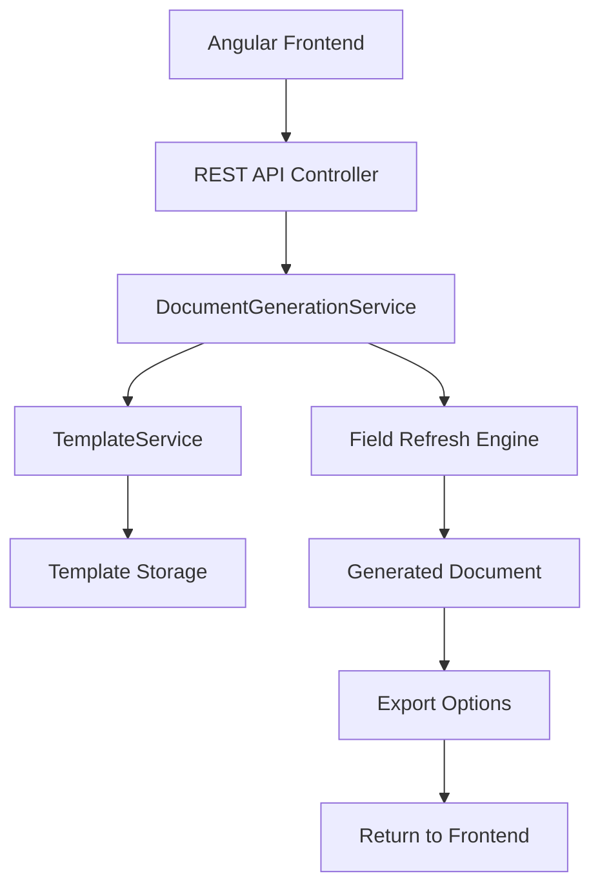

# 🔄 Document Automation Workflow

This document outlines the complete workflow for using the Document Automation Demo system in production environments, particularly for Angular integration.

## 📋 Overview

The Document Automation Demo follows a professional workflow that separates template management from document generation, ensuring scalability and maintainability for enterprise applications.

## 🏗️ System Architecture Flow



## 🚀 Implementation Workflow

### Phase 1: Template Setup
1. **Create Word Template**
   - Design document layout in Microsoft Word
   - Add DOCPROPERTY fields for dynamic content
   - Save as .docx format

2. **Register Template**
   ```csharp
   var templateService = new TemplateService();
   string templateId = templateService.RegisterTemplate(
       "template.docx", 
       "Invoice Template"
   );
   ```

3. **Verify Placeholders**
   ```csharp
   var template = templateService.GetTemplate(templateId);
   var placeholders = template.Placeholders; // Auto-detected
   ```

### Phase 2: Document Generation
1. **Prepare Data**
   ```csharp
   var placeholderValues = new List<PlaceholderValue>
   {
       new() { Placeholder = "CustomerName", Value = "John Doe" },
       new() { Placeholder = "InvoiceDate", Value = DateTime.Now.ToString("yyyy-MM-dd") },
       new() { Placeholder = "Total", Value = "$1,250.00" }
   };
   ```

2. **Generate Document**
   ```csharp
   var docService = new DocumentGenerationService(templateService);
   string outputPath = docService.GenerateDocument(
       templateId,
       placeholderValues,
       "invoice-2025-001",
       ExportFormat.Word
   );
   ```

3. **Field Refresh (Automatic)**
   - System updates document properties
   - Refreshes DOCPROPERTY fields
   - Sets auto-update on document open
   - Clears field caches

### Phase 3: Export & Delivery
1. **Format Selection**
   - Word (.docx) - Full formatting
   - HTML (.html) - Web display
   - PDF (.pdf) - Print-ready

2. **File Delivery**
   - Return file path for local access
   - Stream bytes for web download
   - Save to configured output directory

## 🔌 Angular Integration Pattern

### 1. Service Setup
```typescript
@Injectable({
  providedIn: 'root'
})
export class DocumentService {
  private apiUrl = 'https://api.yourapp.com';

  constructor(private http: HttpClient) {}

  generateDocument(request: DocumentRequest): Observable<Blob> {
    return this.http.post(`${this.apiUrl}/documents/generate`, request, {
      responseType: 'blob'
    });
  }

  getTemplates(): Observable<DocumentTemplate[]> {
    return this.http.get<DocumentTemplate[]>(`${this.apiUrl}/templates`);
  }
}
```

### 2. Component Implementation
```typescript
@Component({
  selector: 'app-document-generator',
  template: `
    <form (ngSubmit)="generateDocument()">
      <select [(ngModel)]="selectedTemplate">
        <option *ngFor="let template of templates" [value]="template.id">
          {{template.name}}
        </option>
      </select>
      
      <div *ngFor="let placeholder of currentPlaceholders">
        <label>{{placeholder}}:</label>
        <input [(ngModel)]="formData[placeholder]" [name]="placeholder">
      </div>
      
      <button type="submit">Generate Document</button>
    </form>
  `
})
export class DocumentGeneratorComponent {
  templates: DocumentTemplate[] = [];
  selectedTemplate: string = '';
  formData: {[key: string]: string} = {};

  generateDocument() {
    const request: DocumentRequest = {
      templateId: this.selectedTemplate,
      placeholders: this.formData,
      filename: `document-${Date.now()}`,
      format: 'word'
    };

    this.documentService.generateDocument(request).subscribe(blob => {
      // Download file
      const url = window.URL.createObjectURL(blob);
      const a = document.createElement('a');
      a.href = url;
      a.download = `${request.filename}.docx`;
      a.click();
      window.URL.revokeObjectURL(url);
    });
  }
}
```

### 3. API Controller
```csharp
[ApiController]
[Route("api/[controller]")]
public class DocumentsController : ControllerBase
{
    private readonly IDocumentGenerationService _docService;
    private readonly ITemplateService _templateService;

    public DocumentsController(
        IDocumentGenerationService docService,
        ITemplateService templateService)
    {
        _docService = docService;
        _templateService = templateService;
    }

    [HttpPost("generate")]
    public async Task<IActionResult> GenerateDocument([FromBody] DocumentRequest request)
    {
        try
        {
            var placeholders = request.Placeholders.Select(kvp => 
                new PlaceholderValue 
                { 
                    Placeholder = kvp.Key, 
                    Value = kvp.Value 
                }).ToList();

            var outputPath = _docService.GenerateDocument(
                request.TemplateId,
                placeholders,
                request.Filename,
                Enum.Parse<ExportFormat>(request.Format, true)
            );

            var fileBytes = await System.IO.File.ReadAllBytesAsync(outputPath);
            var contentType = GetContentType(request.Format);
            var fileName = $"{request.Filename}.{GetFileExtension(request.Format)}";

            return File(fileBytes, contentType, fileName);
        }
        catch (Exception ex)
        {
            return BadRequest(new { error = ex.Message });
        }
    }

    [HttpGet("templates")]
    public IActionResult GetTemplates()
    {
        var templates = _templateService.GetAllTemplates();
        return Ok(templates);
    }
}
```

## 🔧 Configuration & Deployment

### 1. Environment Setup
```json
// appsettings.json
{
  "DocumentAutomation": {
    "TemplatesPath": "./Templates",
    "OutputPath": "./Output",
    "MaxFileSize": "10MB",
    "SupportedFormats": ["word", "html", "pdf"]
  }
}
```

### 2. Dependency Injection
```csharp
// Program.cs or Startup.cs
services.AddSingleton<ITemplateService, TemplateService>();
services.AddScoped<IDocumentGenerationService, DocumentGenerationService>();
```

### 3. File Storage Options
- **Local File System** (Development)
- **Azure Blob Storage** (Cloud)
- **AWS S3** (Cloud)
- **Database BLOB** (Small files)

## 📊 Performance Considerations

### 1. Template Caching
```csharp
public class CachedTemplateService : ITemplateService
{
    private readonly IMemoryCache _cache;
    private readonly ITemplateService _innerService;

    public DocumentTemplate GetTemplate(string templateId)
    {
        return _cache.GetOrCreate($"template_{templateId}", 
            factory => _innerService.GetTemplate(templateId));
    }
}
```

### 2. Async Operations
```csharp
public async Task<string> GenerateDocumentAsync(
    string templateId,
    List<PlaceholderValue> placeholders,
    string outputFileName,
    ExportFormat format)
{
    return await Task.Run(() => 
        GenerateDocument(templateId, placeholders, outputFileName, format));
}
```

### 3. Batch Processing
```csharp
public async Task<List<string>> GenerateMultipleDocumentsAsync(
    List<DocumentGenerationRequest> requests)
{
    var tasks = requests.Select(request => 
        GenerateDocumentAsync(
            request.TemplateId,
            request.PlaceholderValues,
            request.OutputFileName,
            request.ExportFormat
        ));

    return (await Task.WhenAll(tasks)).ToList();
}
```

## 🔒 Security Implementation

### 1. Input Validation
```csharp
public class DocumentRequest
{
    [Required]
    [StringLength(50)]
    public string TemplateId { get; set; }

    [Required]
    [StringLength(100)]
    public string Filename { get; set; }

    [Required]
    [AllowedValues("word", "html", "pdf")]
    public string Format { get; set; }

    [Required]
    public Dictionary<string, string> Placeholders { get; set; }
}
```

### 2. File Path Security
```csharp
private string SanitizeFileName(string fileName)
{
    var invalidChars = Path.GetInvalidFileNameChars();
    var sanitized = string.Join("_", fileName.Split(invalidChars));
    return Regex.Replace(sanitized, @"[^\w\-_\.]", "_");
}
```

### 3. Access Control
```csharp
[Authorize(Roles = "DocumentGenerator")]
[HttpPost("generate")]
public async Task<IActionResult> GenerateDocument([FromBody] DocumentRequest request)
{
    // Implementation
}
```

## 📈 Monitoring & Logging

### 1. Operation Logging
```csharp
public class LoggingDocumentService : IDocumentGenerationService
{
    private readonly ILogger<LoggingDocumentService> _logger;
    private readonly IDocumentGenerationService _innerService;

    public string GenerateDocument(/* parameters */)
    {
        _logger.LogInformation("Starting document generation for template {TemplateId}", templateId);
        
        try
        {
            var result = _innerService.GenerateDocument(/* parameters */);
            _logger.LogInformation("Document generated successfully: {OutputPath}", result);
            return result;
        }
        catch (Exception ex)
        {
            _logger.LogError(ex, "Failed to generate document for template {TemplateId}", templateId);
            throw;
        }
    }
}
```

### 2. Performance Metrics
```csharp
public class MetricsDocumentService : IDocumentGenerationService
{
    private readonly IMetrics _metrics;

    public string GenerateDocument(/* parameters */)
    {
        using var timer = _metrics.Measure.Timer.Time("document_generation_duration");
        _metrics.Measure.Counter.Increment("document_generation_requests");
        
        try
        {
            var result = _innerService.GenerateDocument(/* parameters */);
            _metrics.Measure.Counter.Increment("document_generation_success");
            return result;
        }
        catch
        {
            _metrics.Measure.Counter.Increment("document_generation_errors");
            throw;
        }
    }
}
```

## 🧪 Testing Strategy

### 1. Unit Tests
```csharp
[Test]
public void GenerateDocument_ValidInput_ReturnsOutputPath()
{
    // Arrange
    var mockTemplateService = new Mock<ITemplateService>();
    var service = new DocumentGenerationService(mockTemplateService.Object);
    
    // Act
    var result = service.GenerateDocument(/* test parameters */);
    
    // Assert
    Assert.That(File.Exists(result), Is.True);
}
```

### 2. Integration Tests
```csharp
[Test]
public async Task GenerateDocument_EndToEnd_ProducesValidDocument()
{
    // Arrange
    var client = _factory.CreateClient();
    var request = new DocumentRequest { /* test data */ };
    
    // Act
    var response = await client.PostAsJsonAsync("/api/documents/generate", request);
    
    // Assert
    Assert.That(response.StatusCode, Is.EqualTo(HttpStatusCode.OK));
    var content = await response.Content.ReadAsByteArrayAsync();
    Assert.That(content.Length, Is.GreaterThan(0));
}
```

---

**This workflow ensures a robust, scalable document automation system ready for enterprise Angular applications.** 🚀
