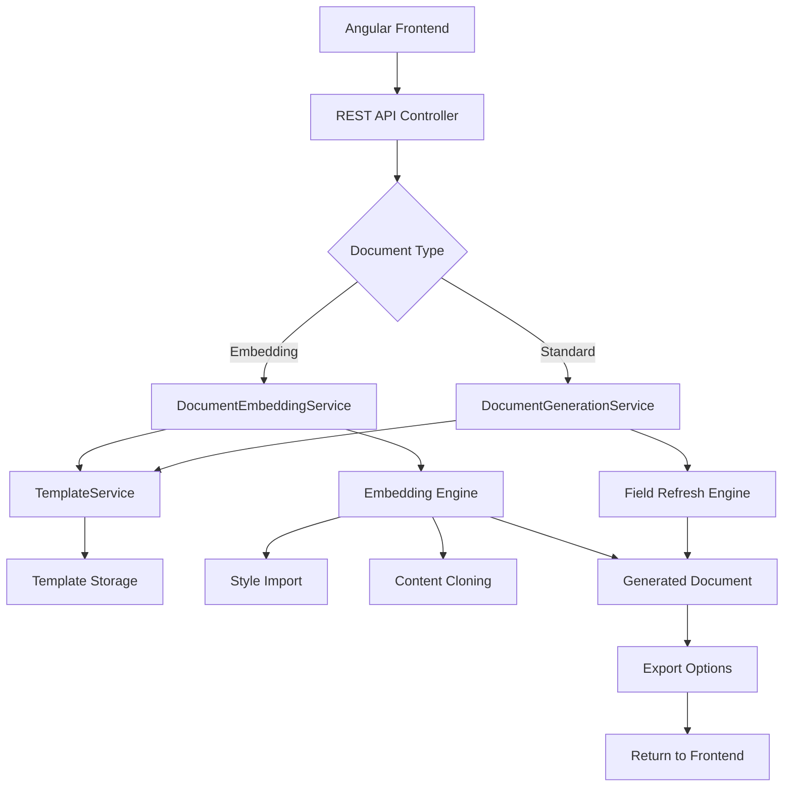

# 🔄 Document Automation Workflow

This document outlines the complete workflow for using the Document Automation Demo system in production environments, particularly for Angular integration. The system supports both standard document generation and advanced document embedding capabilities.

## 📋 Overview

The Document Automation Demo follows a professional workflow that separates template management from document generation, ensuring scalability and maintainability for enterprise applications. It now includes advanced document embedding features for creating complex, multi-section documents.

## 🏗️ System Architecture Flow



## 🚀 Implementation Workflow

### Phase 1: Template Setup

#### Standard Templates
1. **Create Word Template**
   - Design document layout in Microsoft Word
   - Add DOCPROPERTY fields for dynamic content
   - Save as .docx format

2. **Register Template**
   ```csharp
   var templateService = new TemplateService();
   string templateId = templateService.RegisterTemplate(
       "template.docx", 
       "Invoice Template"
   );
   ```

3. **Verify Placeholders**
   ```csharp
   var template = templateService.GetTemplate(templateId);
   var placeholders = template.Placeholders; // Auto-detected
   ```

#### 🆕 Embedding Templates Setup
1. **Create Main Template**
   - Design main document structure
   - Add placeholders for embedded content (e.g., `ICS_EmbeddedDocument`)
   - Include DOCPROPERTY fields for main document data

2. **Create Embed Templates**
   - Design individual content sections
   - Add their own DOCPROPERTY fields
   - Focus on specific content areas (benefits, terms, etc.)

3. **Register Both Templates**
   ```csharp
   string mainTemplateId = templateService.RegisterTemplate("main.docx", "Main Template");
   string embedTemplateId = templateService.RegisterTemplate("embed.docx", "Embed Template");
   ```

### Phase 2: Document Generation

#### Standard Document Generation
1. **Prepare Data**
   ```csharp
   var placeholderValues = new List<PlaceholderValue>
   {
       new() { Placeholder = "CustomerName", Value = "John Doe" },
       new() { Placeholder = "InvoiceDate", Value = DateTime.Now.ToString("yyyy-MM-dd") },
       new() { Placeholder = "Total", Value = "$1,250.00" }
   };
   ```

2. **Generate Document**
   ```csharp
   var docService = new DocumentGenerationService(templateService);
   string outputPath = docService.GenerateDocument(
       templateId,
       placeholderValues,
       "invoice-2025-001",
       ExportFormat.Word
   );
   ```

3. **Field Refresh (Automatic)**
   - System updates document properties
   - Refreshes DOCPROPERTY fields
   - Sets auto-update on document open
   - Clears field caches

#### 🆕 Document Embedding Generation
1. **Prepare Main Document Data**
   ```csharp
   var mainPlaceholders = new List<PlaceholderValue>
   {
       new() { Placeholder = "CustomerName", Value = "Acme Corp" },
       new() { Placeholder = "PolicyNumber", Value = "POL-12345" }
   };
   ```

2. **Prepare Embed Document Data**
   ```csharp
   var embedPlaceholders = new List<PlaceholderValue>
   {
       new() { Placeholder = "BenefitName", Value = "Health Coverage" },
       new() { Placeholder = "BenefitLimit", Value = "$50,000" }
   };
   ```

3. **Configure Embeddings**
   ```csharp
   var embeddings = new List<EmbedInfo>
   {
       new EmbedInfo
       {
           EmbedTemplateId = embedTemplateId,
           EmbedTemplateValues = embedPlaceholders,
           EmbedPlaceholder = "ICS_HealthBenefits"
       }
   };
   ```

4. **Generate Embedded Document**
   ```csharp
   var embeddingService = new DocumentEmbeddingService(templateService);
   var request = new DocumentEmbeddingRequest
   {
       MainTemplateId = mainTemplateId,
       MainTemplateValues = mainPlaceholders,
       Embeddings = embeddings,
       ExportFormat = ExportFormat.Word
   };
   
   string outputPath = embeddingService.GenerateDocumentWithEmbedding(request);
   ```

5. **Embedding Process (Automatic)**
   - Main template processing (excluding embed placeholders)
   - Individual embed template processing
   - Style import and conflict resolution
   - Content insertion at specified placeholders
   - Image and numbering reference management

### Phase 3: Export & Delivery
1. **Format Selection**
   - Word (.docx) - Full formatting, editable
   - HTML (.html) - Web display, email compatible
   - PDF (.pdf) - Print-ready, non-editable

2. **File Delivery**
   - Return file path for local access
   - Stream bytes for web download
   - Save to configured output directory

## 🔌 Angular Integration Pattern

### 1. Service Setup
```typescript
@Injectable({
  providedIn: 'root'
})
export class DocumentService {
  private apiUrl = 'https://api.yourapp.com';

  constructor(private http: HttpClient) {}

  // Standard document generation
  generateDocument(request: DocumentRequest): Observable<Blob> {
    return this.http.post(`${this.apiUrl}/documents/generate`, request, {
      responseType: 'blob'
    });
  }

  // 🆕 Document embedding generation
  generateEmbeddedDocument(request: DocumentEmbeddingRequest): Observable<Blob> {
    return this.http.post(`${this.apiUrl}/documents/generate-embedded`, request, {
      responseType: 'blob'
    });
  }

  getTemplates(): Observable<DocumentTemplate[]> {
    return this.http.get<DocumentTemplate[]>(`${this.apiUrl}/templates`);
  }
}
```

### 2. Component Implementation
```typescript
@Component({
  selector: 'app-document-generator',
  template: `
    <div class="document-generator">
      <h2>Document Generation</h2>
      
      <!-- Template Selection -->
      <div class="form-group">
        <label>Template:</label>
        <select [(ngModel)]="selectedTemplate" (change)="onTemplateChange()">
          <option *ngFor="let template of templates" [value]="template.id">
            {{template.name}}
          </option>
        </select>
      </div>
      
      <!-- Generation Type -->
      <div class="form-group">
        <label>Generation Type:</label>
        <select [(ngModel)]="generationType">
          <option value="standard">Standard Document</option>
          <option value="embedding">Document with Embedding</option>
        </select>
      </div>
      
      <!-- Standard Generation Form -->
      <div *ngIf="generationType === 'standard'" class="standard-form">
        <h3>Document Data</h3>
        <div *ngFor="let placeholder of currentPlaceholders" class="form-group">
          <label>{{placeholder}}:</label>
          <input [(ngModel)]="formData[placeholder]" [name]="placeholder">
        </div>
      </div>
      
      <!-- Embedding Generation Form -->
      <div *ngIf="generationType === 'embedding'" class="embedding-form">
        <h3>Main Document Data</h3>
        <div *ngFor="let placeholder of mainPlaceholders" class="form-group">
          <label>{{placeholder}}:</label>
          <input [(ngModel)]="mainFormData[placeholder]" [name]="placeholder">
        </div>
        
        <h3>Embeddings</h3>
        <div *ngFor="let embedding of embeddings; let i = index" class="embedding-section">
          <h4>Embedding {{i + 1}}</h4>
          <div class="form-group">
            <label>Embed Template:</label>
            <select [(ngModel)]="embedding.embedTemplateId">
              <option *ngFor="let template of wordTemplates" [value]="template.id">
                {{template.name}}
              </option>
            </select>
          </div>
          <div class="form-group">
            <label>Placeholder Location:</label>
            <input [(ngModel)]="embedding.embedPlaceholder" placeholder="ICS_EmbeddedDocument">
          </div>
          <div *ngFor="let placeholder of getEmbedPlaceholders(embedding.embedTemplateId)" class="form-group">
            <label>{{placeholder}}:</label>
            <input [(ngModel)]="embedding.values[placeholder]">
          </div>
          <button type="button" (click)="removeEmbedding(i)">Remove Embedding</button>
        </div>
        <button type="button" (click)="addEmbedding()">Add Embedding</button>
      </div>
      
      <!-- Export Format -->
      <div class="form-group">
        <label>Export Format:</label>
        <select [(ngModel)]="exportFormat">
          <option value="word">Word (.docx)</option>
          <option value="pdf">PDF (.pdf)</option>
          <option value="html">HTML (.html)</option>
        </select>
      </div>
      
      <button type="submit" (click)="generateDocument()" [disabled]="isGenerating">
        {{isGenerating ? 'Generating...' : 'Generate Document'}}
      </button>
    </div>
  `
})
export class DocumentGeneratorComponent implements OnInit {
  templates: DocumentTemplate[] = [];
  wordTemplates: DocumentTemplate[] = [];
  selectedTemplate: string = '';
  generationType: 'standard' | 'embedding' = 'standard';
  exportFormat: string = 'word';
  isGenerating: boolean = false;
  
  // Standard generation
  formData: {[key: string]: string} = {};
  currentPlaceholders: string[] = [];
  
  // Embedding generation
  mainFormData: {[key: string]: string} = {};
  mainPlaceholders: string[] = [];
  embeddings: EmbedInfo[] = [];

  constructor(private documentService: DocumentService) {}

  ngOnInit() {
    this.loadTemplates();
  }

  loadTemplates() {
    this.documentService.getTemplates().subscribe(templates => {
      this.templates = templates;
      this.wordTemplates = templates.filter(t => t.documentType === 0); // Word documents only
    });
  }

  onTemplateChange() {
    const template = this.templates.find(t => t.id === this.selectedTemplate);
    if (template) {
      this.currentPlaceholders = template.placeholders;
      this.mainPlaceholders = template.placeholders.filter(p => !p.startsWith('ICS_Embed'));
    }
  }

  addEmbedding() {
    this.embeddings.push({
      embedTemplateId: '',
      values: {},
      embedPlaceholder: ''
    });
  }

  removeEmbedding(index: number) {
    this.embeddings.splice(index, 1);
  }

  getEmbedPlaceholders(templateId: string): string[] {
    const template = this.templates.find(t => t.id === templateId);
    return template ? template.placeholders : [];
  }

  generateDocument() {
    this.isGenerating = true;

    if (this.generationType === 'standard') {
      this.generateStandardDocument();
    } else {
      this.generateEmbeddedDocument();
    }
  }

  generateStandardDocument() {
    const request: DocumentRequest = {
      templateId: this.selectedTemplate,
      placeholders: this.formData,
      filename: `document-${Date.now()}`,
      format: this.exportFormat as any
    };

    this.documentService.generateDocument(request).subscribe(
      blob => {
        this.downloadFile(blob, `${request.filename}.${this.getFileExtension()}`);
        this.isGenerating = false;
      },
      error => {
        console.error('Error generating document:', error);
        this.isGenerating = false;
      }
    );
  }

  generateEmbeddedDocument() {
    const request: DocumentEmbeddingRequest = {
      mainTemplateId: this.selectedTemplate,
      mainValues: this.mainFormData,
      embeddings: this.embeddings,
      exportFormat: this.exportFormat as any
    };

    this.documentService.generateEmbeddedDocument(request).subscribe(
      blob => {
        this.downloadFile(blob, `embedded-document-${Date.now()}.${this.getFileExtension()}`);
        this.isGenerating = false;
      },
      error => {
        console.error('Error generating embedded document:', error);
        this.isGenerating = false;
      }
    );
  }

  private downloadFile(blob: Blob, filename: string) {
    const url = window.URL.createObjectURL(blob);
    const a = document.createElement('a');
    a.href = url;
    a.download = filename;
    a.click();
    window.URL.revokeObjectURL(url);
  }

  private getFileExtension(): string {
    switch (this.exportFormat) {
      case 'pdf': return 'pdf';
      case 'html': return 'html';
      case 'word':
      default: return 'docx';
    }
  }
}

// TypeScript interfaces
interface DocumentRequest {
  templateId: string;
  placeholders: { [key: string]: string };
  filename: string;
  format: 'word' | 'html' | 'pdf';
}

interface DocumentEmbeddingRequest {
  mainTemplateId: string;
  mainValues: { [key: string]: string };
  embeddings: EmbedInfo[];
  exportFormat: 'word' | 'html' | 'pdf';
}

interface EmbedInfo {
  embedTemplateId: string;
  values: { [key: string]: string };
  embedPlaceholder: string;
}

interface DocumentTemplate {
  id: string;
  name: string;
  placeholders: string[];
  documentType: number;
}
```

### 3. API Controller
```csharp
[ApiController]
[Route("api/[controller]")]
public class DocumentsController : ControllerBase
{
    private readonly IDocumentGenerationService _docService;
    private readonly IDocumentEmbeddingService _embeddingService;
    private readonly ITemplateService _templateService;

    public DocumentsController(
        IDocumentGenerationService docService,
        IDocumentEmbeddingService embeddingService,
        ITemplateService templateService)
    {
        _docService = docService;
        _embeddingService = embeddingService;
        _templateService = templateService;
    }

    [HttpPost("generate")]
    public async Task<IActionResult> GenerateDocument([FromBody] DocumentRequest request)
    {
        try
        {
            var placeholders = request.Placeholders.Select(kvp => 
                new PlaceholderValue 
                { 
                    Placeholder = kvp.Key, 
                    Value = kvp.Value 
                }).ToList();

            var outputPath = _docService.GenerateDocument(
                request.TemplateId,
                placeholders,
                request.Filename,
                Enum.Parse<ExportFormat>(request.Format, true)
            );

            var fileBytes = await System.IO.File.ReadAllBytesAsync(outputPath);
            var contentType = GetContentType(request.Format);
            var fileName = $"{request.Filename}.{GetFileExtension(request.Format)}";

            return File(fileBytes, contentType, fileName);
        }
        catch (Exception ex)
        {
            return BadRequest(new { error = ex.Message });
        }
    }

    [HttpPost("generate-embedded")]
    public async Task<IActionResult> GenerateEmbeddedDocument([FromBody] DocumentEmbeddingRequest request)
    {
        try
        {
            var mainPlaceholders = request.MainValues.Select(kvp => 
                new PlaceholderValue 
                { 
                    Placeholder = kvp.Key, 
                    Value = kvp.Value 
                }).ToList();

            var embeddings = request.Embeddings.Select(e => new EmbedInfo
            {
                EmbedTemplateId = e.EmbedTemplateId,
                EmbedPlaceholder = e.EmbedPlaceholder,
                EmbedTemplateValues = e.Values.Select(kvp => new PlaceholderValue
                {
                    Placeholder = kvp.Key,
                    Value = kvp.Value
                }).ToList()
            }).ToList();

            var embeddingRequest = new DocumentEmbeddingRequest
            {
                MainTemplateId = request.MainTemplateId,
                MainTemplateValues = mainPlaceholders,
                Embeddings = embeddings,
                ExportFormat = Enum.Parse<ExportFormat>(request.ExportFormat, true)
            };

            var outputPath = _embeddingService.GenerateDocumentWithEmbedding(embeddingRequest);

            var fileBytes = await System.IO.File.ReadAllBytesAsync(outputPath);
            var contentType = GetContentType(request.ExportFormat);
            var fileName = $"embedded-document-{DateTime.Now:yyyyMMdd}.{GetFileExtension(request.ExportFormat)}";

            return File(fileBytes, contentType, fileName);
        }
        catch (Exception ex)
        {
            return BadRequest(new { error = ex.Message });
        }
    }

    [HttpGet("templates")]
    public IActionResult GetTemplates()
    {
        var templates = _templateService.GetAllTemplates();
        return Ok(templates);
    }

    private string GetContentType(string format) => format.ToLower() switch
    {
        "pdf" => "application/pdf",
        "html" => "text/html",
        "word" => "application/vnd.openxmlformats-officedocument.wordprocessingml.document",
        _ => "application/vnd.openxmlformats-officedocument.wordprocessingml.document"
    };

    private string GetFileExtension(string format) => format.ToLower() switch
    {
        "pdf" => "pdf",
        "html" => "html",
        "word" => "docx",
        _ => "docx"
    };
}
```

## 🔧 Configuration & Deployment

### 1. Environment Setup
```json
// appsettings.json
{
  "DocumentAutomation": {
    "TemplatesPath": "./Templates",
    "OutputPath": "./Output",
    "MaxFileSize": "10MB",
    "SupportedFormats": ["word", "html", "pdf"],
    "EmbeddingSettings": {
      "MaxEmbeddings": 10,
      "EnableStyleImport": true,
      "EnableImageImport": true,
      "TempFileCleanup": true
    }
  }
}
```

### 2. Dependency Injection
```csharp
// Program.cs or Startup.cs
services.AddSingleton<ITemplateService, TemplateService>();
services.AddScoped<IDocumentGenerationService, DocumentGenerationService>();
services.AddScoped<IDocumentEmbeddingService, DocumentEmbeddingService>(); // 🆕

// Optional: Add caching for performance
services.AddMemoryCache();
services.Decorate<ITemplateService, CachedTemplateService>();
```

### 3. File Storage Options
- **Local File System** (Development)
- **Azure Blob Storage** (Cloud)
- **AWS S3** (Cloud)
- **Database BLOB** (Small files)

## 📊 Performance Considerations

### 1. Template Caching
```csharp
public class CachedTemplateService : ITemplateService
{
    private readonly IMemoryCache _cache;
    private readonly ITemplateService _innerService;

    public DocumentTemplate GetTemplate(string templateId)
    {
        return _cache.GetOrCreate($"template_{templateId}", 
            factory => _innerService.GetTemplate(templateId));
    }
}
```

### 2. Async Operations
```csharp
public async Task<string> GenerateDocumentAsync(
    string templateId,
    List<PlaceholderValue> placeholders,
    string outputFileName,
    ExportFormat format)
{
    return await Task.Run(() => 
        GenerateDocument(templateId, placeholders, outputFileName, format));
}

// 🆕 Async document embedding
public async Task<string> GenerateDocumentWithEmbeddingAsync(
    DocumentEmbeddingRequest request)
{
    return await Task.Run(() => 
        GenerateDocumentWithEmbedding(request));
}
```

### 3. Batch Processing
```csharp
public async Task<List<string>> GenerateMultipleDocumentsAsync(
    List<DocumentGenerationRequest> requests)
{
    var tasks = requests.Select(request => 
        GenerateDocumentAsync(
            request.TemplateId,
            request.PlaceholderValues,
            request.OutputFileName,
            request.ExportFormat
        ));

    return (await Task.WhenAll(tasks)).ToList();
}

// 🆕 Batch embedding processing
public async Task<List<string>> GenerateMultipleEmbeddedDocumentsAsync(
    List<DocumentEmbeddingRequest> requests)
{
    var tasks = requests.Select(request => 
        GenerateDocumentWithEmbeddingAsync(request));

    return (await Task.WhenAll(tasks)).ToList();
}
```

### 4. 🆕 Embedding Performance Optimization
```csharp
public class OptimizedDocumentEmbeddingService : IDocumentEmbeddingService
{
    private readonly IMemoryCache _styleCache;
    
    // Cache frequently used styles across embeddings
    private void CacheCommonStyles(WordprocessingDocument document)
    {
        var commonStyles = ExtractCommonStyles(document);
        _styleCache.Set($"styles_{document.GetHashCode()}", commonStyles, TimeSpan.FromHours(1));
    }

    // Reuse cached styles to reduce processing time
    private void ApplyCachedStyles(WordprocessingDocument targetDoc, string cacheKey)
    {
        if (_styleCache.TryGetValue(cacheKey, out var cachedStyles))
        {
            ApplyStyles(targetDoc, cachedStyles);
        }
    }
}
```

## 🔒 Security Implementation

### 1. Input Validation
```csharp
public class DocumentRequest
{
    [Required]
    [StringLength(50)]
    public string TemplateId { get; set; }

    [Required]
    [StringLength(100)]
    public string Filename { get; set; }

    [Required]
    [AllowedValues("word", "html", "pdf")]
    public string Format { get; set; }

    [Required]
    public Dictionary<string, string> Placeholders { get; set; }
}
```

### 2. File Path Security
```csharp
private string SanitizeFileName(string fileName)
{
    var invalidChars = Path.GetInvalidFileNameChars();
    var sanitized = string.Join("_", fileName.Split(invalidChars));
    return Regex.Replace(sanitized, @"[^\w\-_\.]", "_");
}
```

### 3. Access Control
```csharp
[Authorize(Roles = "DocumentGenerator")]
[HttpPost("generate")]
public async Task<IActionResult> GenerateDocument([FromBody] DocumentRequest request)
{
    // Implementation
}
```

## 📈 Monitoring & Logging

### 1. Operation Logging
```csharp
public class LoggingDocumentService : IDocumentGenerationService
{
    private readonly ILogger<LoggingDocumentService> _logger;
    private readonly IDocumentGenerationService _innerService;

    public string GenerateDocument(/* parameters */)
    {
        _logger.LogInformation("Starting document generation for template {TemplateId}", templateId);
        
        try
        {
            var result = _innerService.GenerateDocument(/* parameters */);
            _logger.LogInformation("Document generated successfully: {OutputPath}", result);
            return result;
        }
        catch (Exception ex)
        {
            _logger.LogError(ex, "Failed to generate document for template {TemplateId}", templateId);
            throw;
        }
    }
}

// 🆕 Logging for embedding service
public class LoggingEmbeddingService : IDocumentEmbeddingService
{
    private readonly ILogger<LoggingEmbeddingService> _logger;
    private readonly IDocumentEmbeddingService _innerService;

    public string GenerateDocumentWithEmbedding(DocumentEmbeddingRequest request)
    {
        _logger.LogInformation("Starting embedded document generation for main template {MainTemplateId} with {EmbeddingCount} embeddings", 
            request.MainTemplateId, request.Embeddings.Count);
        
        try
        {
            var result = _innerService.GenerateDocumentWithEmbedding(request);
            _logger.LogInformation("Embedded document generated successfully: {OutputPath}", result);
            return result;
        }
        catch (Exception ex)
        {
            _logger.LogError(ex, "Failed to generate embedded document for template {MainTemplateId}", request.MainTemplateId);
            throw;
        }
    }
}
```

### 2. Performance Metrics
```csharp
public class MetricsDocumentService : IDocumentGenerationService
{
    private readonly IMetrics _metrics;

    public string GenerateDocument(/* parameters */)
    {
        using var timer = _metrics.Measure.Timer.Time("document_generation_duration");
        _metrics.Measure.Counter.Increment("document_generation_requests");
        
        try
        {
            var result = _innerService.GenerateDocument(/* parameters */);
            _metrics.Measure.Counter.Increment("document_generation_success");
            return result;
        }
        catch
        {
            _metrics.Measure.Counter.Increment("document_generation_errors");
            throw;
        }
    }
}

// 🆕 Metrics for embedding operations
public class MetricsEmbeddingService : IDocumentEmbeddingService
{
    private readonly IMetrics _metrics;

    public string GenerateDocumentWithEmbedding(DocumentEmbeddingRequest request)
    {
        using var timer = _metrics.Measure.Timer.Time("document_embedding_duration");
        _metrics.Measure.Counter.Increment("document_embedding_requests");
        _metrics.Measure.Gauge.SetValue("embedding_count", request.Embeddings.Count);
        
        try
        {
            var result = _innerService.GenerateDocumentWithEmbedding(request);
            _metrics.Measure.Counter.Increment("document_embedding_success");
            return result;
        }
        catch
        {
            _metrics.Measure.Counter.Increment("document_embedding_errors");
            throw;
        }
    }
}
```
---

**This comprehensive workflow ensures a robust, scalable document automation system with advanced embedding capabilities, ready for enterprise Angular applications.** 🚀

## 🎯 Business Use Cases

### Standard Document Generation
- **Invoices**: Generate invoices with customer data and line items
- **Contracts**: Create contracts with personalized terms and conditions
- **Reports**: Generate reports with dynamic charts and calculations
- **Certificates**: Produce certificates with recipient information

### 🆕 Document Embedding Scenarios
- **Insurance Policies**: 
  - Main policy document with embedded coverage details
  - Terms and conditions as separate embedded sections
  - Claims procedures embedded in relevant sections

- **Legal Documents**:
  - Main contract with embedded standard clauses
  - Appendices and schedules as embedded documents
  - Jurisdiction-specific terms embedded based on location

- **Technical Documentation**:
  - Main manual with embedded technical specifications
  - Safety guidelines embedded in relevant chapters
  - Troubleshooting sections embedded contextually

- **Training Materials**:
  - Main curriculum with embedded course modules
  - Assessment documents embedded after each section
  - Resource materials embedded as references

### Benefits of Embedding Approach
- **Modularity**: Reusable content components
- **Consistency**: Standardized formatting across documents
- **Maintainability**: Update embed templates independently
- **Flexibility**: Mix and match content based on requirements
- **Quality**: Professional formatting preserved throughout
